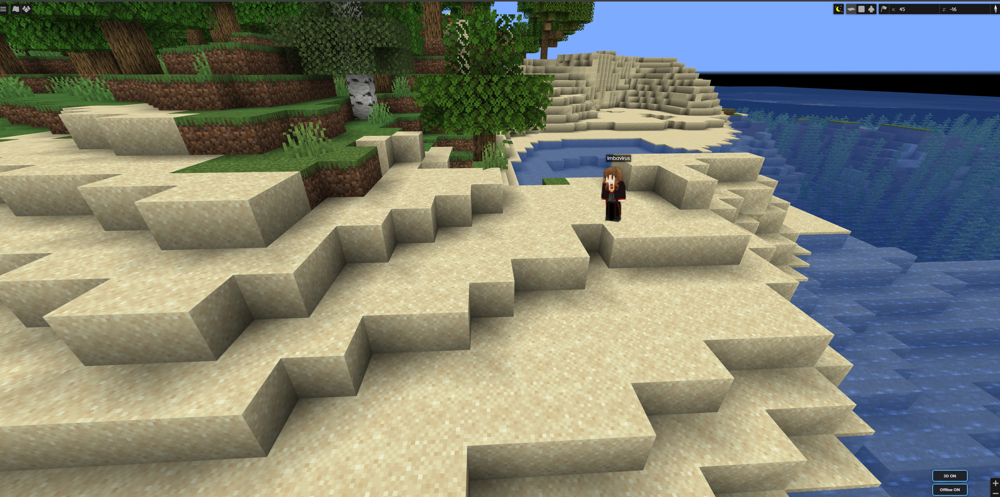
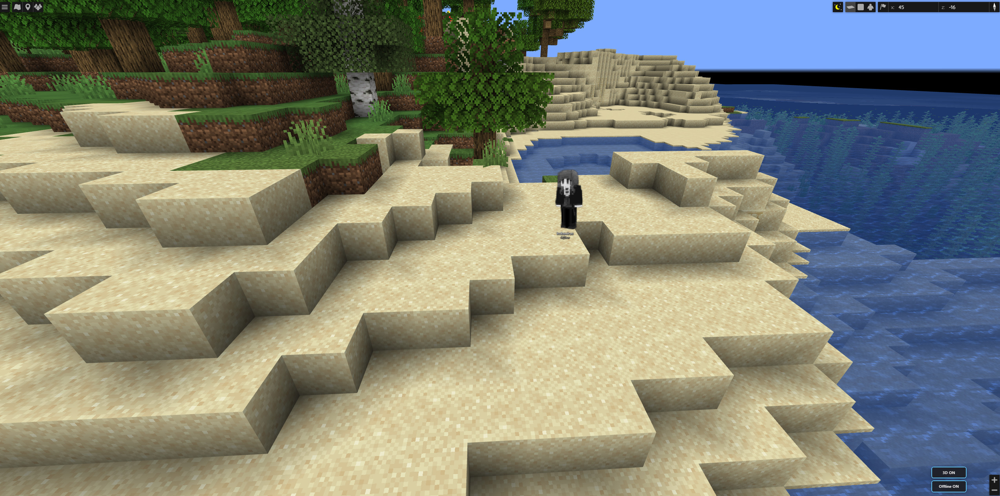

# BlueMap Offline Player Markers (NeoForge)

Adds markers where players have logged off to [BlueMap](https://github.com/BlueMap-Minecraft/BlueMap) — with optional full-body skins, offline greyscale styling, and in-map toggles.

**Target:** Minecraft **1.21.1** · **NeoForge** 21.1.x · requires **BlueMap**

| Online (full color) | Offline (greyscale) |
|---------------------|---------------------|
|  |  |

*Left: online player with real skin and name tag. Right: same spot offline — greyscale model and Offline label. Bottom-right: **3D** / **Offline** map controls.*

## Features

- **Offline markers** at each player’s last logout position (and dimension)
- **Player skins** on markers (with caching)
- **Optional full-body models** on the web map (toggle in-map and in config)
- **World-scale bodies** — sized to about a real player height (~1.8 blocks) as you zoom
- **Facing** matches the player’s in-game yaw when available
- **Offline styling** — greyscale + clear Offline labeling
- **Map controls** — show/hide 3D models and offline markers from the BlueMap UI
- Config for marker set name, expiry hours, hidden game modes, banned players, model defaults

## Requirements

| | |
|---|---|
| Minecraft | **1.21.1** |
| Loader | **NeoForge** 21.1.x |
| Dependency | **BlueMap** (NeoForge) |

Server-side for map features (players don’t need this mod to appear on BlueMap).

## Install

1. Install NeoForge + BlueMap on the **server**.
2. Drop this mod into the server `mods` folder.
3. Start once, then adjust config if needed.
4. Open BlueMap and use the **3D** / **Offline** buttons.

Reload BlueMap with `/bluemap reload` after config changes when supported.

## Config highlights

- **ExpireTimeInHours** — only keep recent logouts (`0` = keep all)
- **HideBannedPlayers**
- **HiddenGameModes** (e.g. spectator)
- **ShowPlayerModels** / **AnimatePlayerModels**

## Screenshots (gallery sources)

Same images for CurseForge / Modrinth uploads:

- [Online full-body model](https://i.gyazo.com/876492a278f8994f5f6ae19b665b3165.jpg)
- [Offline greyscale + Offline label](https://i.gyazo.com/a1484bcfebe5548acd6ea3fadca45a20.jpg)

## Download

- [Releases](../../releases/latest)
- Branch: [`neoforge`](https://github.com/imbavirus/BlueMapOfflinePlayerMarkers/tree/neoforge)

## Credits

Based on the original [BlueMap Offline Player Markers](https://github.com/TechnicJelle/BlueMapOfflinePlayerMarkers) by **TechnicJelle** and contributors (**MIT**).

Special thanks to Seercat3160, Mark-255, elsing, LOOHP, Blue (TBlueF), and everyone who contributed to the original project.

Other platform ports of the original (not maintained here):

- [Fabric](https://github.com/syorito-hatsuki/BlueMapOfflinePlayerMarkersFabric)
- [Forge](https://github.com/FLORIAN4600/BlueMapOfflinePlayerMarkersForge)
- [Folia](https://github.com/kgncengiz/BlueMapOfflinePlayerMarkersFoliaFork)

## License

MIT — see [LICENSE](LICENSE).
